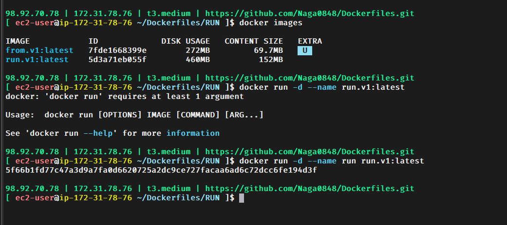
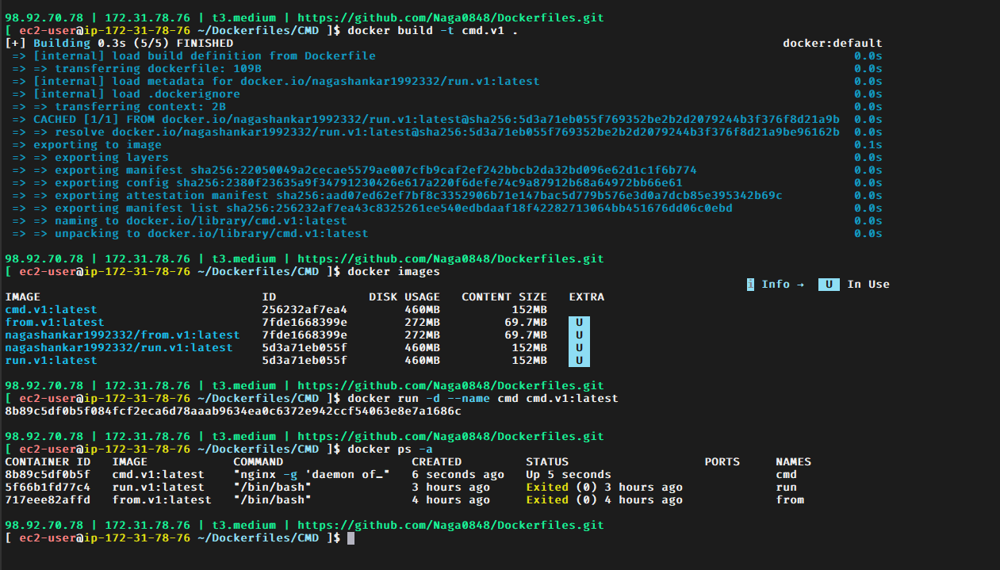
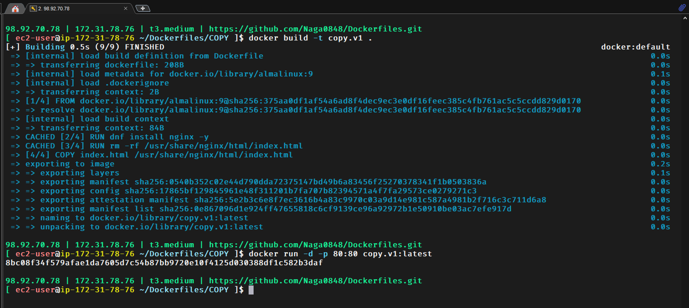
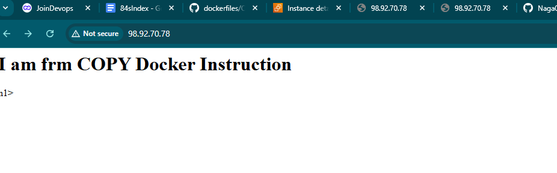
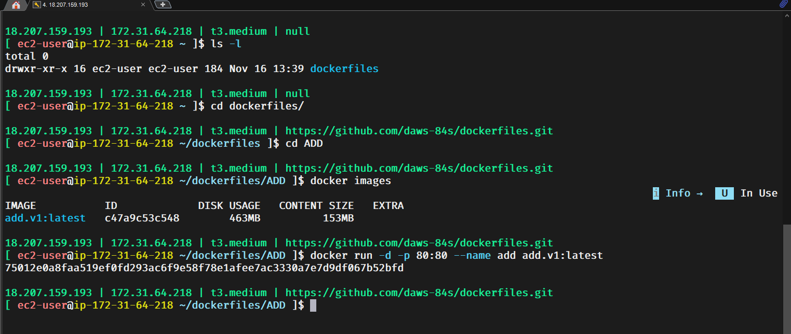
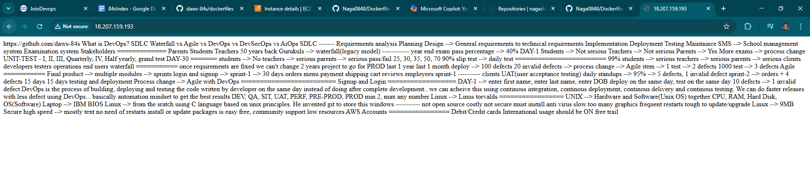
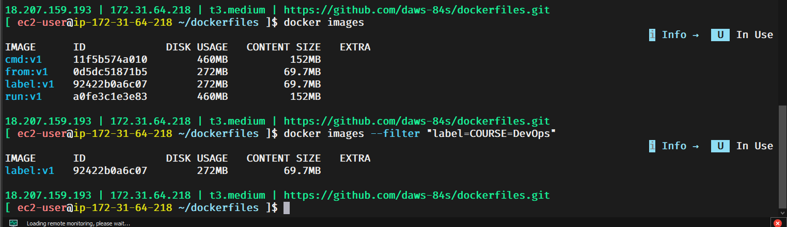
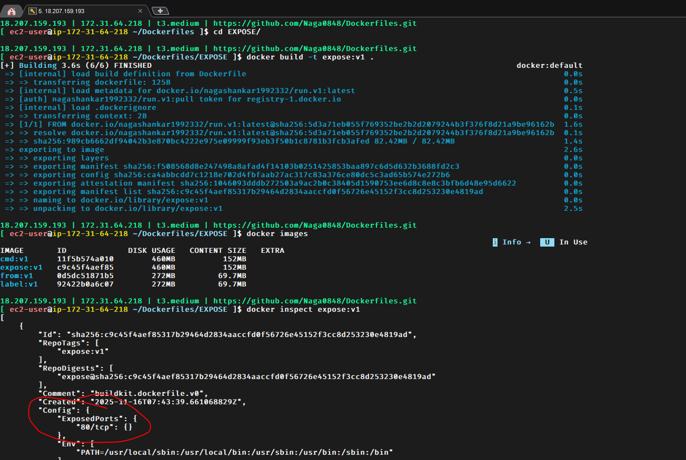
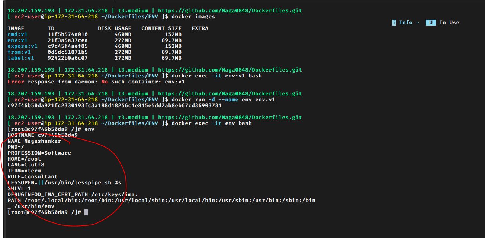

#### Dockerfiles

#### In this Repo, we are just understanding the different instructions which we use in our Dockerfile and that is the reaon we mention CMD and give a sleep command to run the container.

#### Commands to install Docker on an EC2

    sudo dnf -y install dnf-plugins-core

    sudo dnf config-manager --add-repo https://download.docker.com/linux/rhel/docker-ce.repo

    sudo dnf install docker-ce docker-ce-cli containerd.io docker-buildx-plugin docker-compose-plugin

    sudo systemctl restart docker

    sudo systemctl enable --now docker

    sudo usermod -aG docker ec2-user

#### add your normal user to docker group  -- because we cannot run the docker commands as a normal ec2-user

    exit, after adding normal user and re-login and start using the docker commands without giving sudo

    Again after logging in, we have to start and enable the docker

    sudo systemctl start docker
    sudo systemctl enable docker

 # My Docker Credentials
    username - nagashankar1992332

 #### Docker Basic Commands

        docker images 

        docker pull <image-name>:<tag/version> --> get the image

        docker create nginx

        docker ps -a --> all containers including all status

        docker start <container-ID>

        docker rm <container-ID>

        docker run <image>:<tag> -> pull image + create container + start container

        docker run -d nginx --> detach the screen

        docker ps a -q ====> to display all the containers

        docker rm -f 'docker ps a -q'  ====> to delete all the containers at a time

        0-65,535   === total no of ports for a container or a server

        docker run -d -p 80:80 nginx

        docker exec -it nginx bash   ===> to login to a container

        docker inspect container-name/container-ID

#### General Notes

    How can you create custom images to your applications?

    Dockerfile --> a set of instructions to create customised images

    FROM
    =========
    FROM almalinux:9

    docker build -t from:v1 . --> current directory has Dockerfile

    RUN
    =========
    RUN commands

    RUN instructions configure the image like installing packages, doing some configurations, etc..
    RUN executes at the time of image creation

    systemctl start nginx --> etc/systemd/system/nginx.service

    docker pull nginx -> first it checks locally, if it does not exist it checks in hub

    CMD
    =========
    CMD executes at the time of container creation i.e at the time of docker run. there should be only one CMD instruction inside Dockerfile

    COPY
    =========
    copies the code from local to container

    ADD
    =========
    COPY and ADD both copies the code from local to container. but it has two more advantages

    1. it can directly fetch the file from internet
    2. it can directly untar the file into container

    ENTRYPOINT
    =============
    CMD instruction can be overriden
    We can't override ENTRYPOINT, if we try to do it will override
    We can use combination of CMD and ENTRYPOINT for better results, ENTRYPOINT will have command, default args can be supplied by CMD
    You can always override default args through command line

    ping google.com ping facebook.com

    ARG
    =======
    ARG is build time variables, they can't be accessed inside container. ENV can be accessed build time and then inside container also
    ARG instruction variables can be overriden

    in an exceptional case ARG can be the first instruction to supply version to base OS in FROM, you cant use that version after FROM instruction

    How can you use ARG inside container?

    ONBUILD
    ========
    While devloping images you can put some conditions while others are using your images...

## Understanding the Docker Instructions One-By-One

    FROM Instruction

    docker build -t from:v1   >>> command to build an image
        
    docker images >>> to view the images
        
    docker run -d --name from from.v1:latest  >>> indicates that we are running a container whose name is from and it is created from an image named from.
    v1:latest

    RUN Instruction 

    Here we are installing nginx via docker image(in the dockerfile)

    docker build -t run:v1 . >>> command to build an image

    docker images >>> to view the images
    
    dokcer run -d --name run run.v1:latest  >>> indicates that we are running a container whose name is run and it is created from an image named run.
    v1:latest
    
    RUN Instruction 

    Here we are using the run image which is already existing in my dockerhub (so base image is FROM nagashankar1992332/run.v1:latest)

    docker build -t cmd:v1 . >>> command to build an image

    docker images >>> to view the images
    
    dokcer run -d --name cmd cmd.v1:latest  >>> indicates that we are running a container whose name is cmd and it is created from an image named cmd.
    v1:latest

    COPY Instruction 
    Here we are using an index.html in the Dockerfile and finally when we take the publicIP (http://publicIP)  it displays the data inside the index.html
    
    docker build -t copy:v1 . >>> command to build an image

    docker images >>> to view the images
    
    dokcer run -d --name copy copy.v1:latest  >>> indicates that we are running a container whose name is cmd and it is created from an image named copy.
    v1:latest

    ADD Instruction 
    Here we are using an a github link Dockerfile and it fetches the data from Internet directly and finally when we take the publicIP (http://publicIP)  it displays the data inside the the github link
    
    docker build -t add:v1 . >>> command to build an image
    docker images >>> to view the images
    
    dokcer run -d --name add add.v1:latest  >>> indicates that we are running a container whose name is cmd and it is created from an image named add.
    v1:latest

    LABEL Instruction 
    
    docker build -t label:v1 . >>> command to build an image
    docker images >>> to view the images
    
    dokcer run -d --name add add.v1:latest  >>> indicates that we are running a container whose name is cmd and it is created from an image named label:v1

    docker images --filter "label=COURSE=DevOps"   >>> when we have multiple images we can use the label to filter our image

    EXPOSE Instruction 
    
    docker build -t expose:v1 . >>> command to build an image
    docker images >>> to view the images
    
    dokcer run -d --name expose expose:v1   >>> indicates that we are running a container whose name is expose and it is created from an image named expose:v1

    Here we run the docker inspect <image-name>   to see the expose port

    ENV Instruction 
    
    docker build -t env:v1 . >>> command to build an image
    docker images >>> to view the images
    
    dokcer run -d --name expose expose:v1   >>> indicates that we are running a container whose name is env and it is created from an image named 
    env:v1
    Here we run the docker exec -it <container-name> bash  >>> env 
        to see the env variables inside the container

  The below image is for FROM instruction

  

  The below image is for RUN instruction  
  

  The below image is for CMD instruction
  

  The below image is for COPY instruction
  
  

  The below image is for ADD instruction
  
  

  The below image is for label instruction
  

  The below image is for EXPOSE instruction  
  

  The below image is for ENV instruction 
  

#### To push your images into Docker Hub 
    
    
    We need to Tag our Local Image for Docker Hub

    docker tag from.v1:latest nagashankar1992332/from.v1:latest
    docker tag cmd.v1:latest nagashankar1992332/cmd.v1:latest
    docker tag run.v1:latest nagashankar1992332/run.v1:latest

    Push the Tagged Images

    docker push nagashankar1992332/from.v1:latest
    docker push nagashankar1992332/cmd.v1:latest
    docker push nagashankar1992332/run.v1:latest

    docker exec -it <container-name> bash --- command to login to the container

    
    
    
    